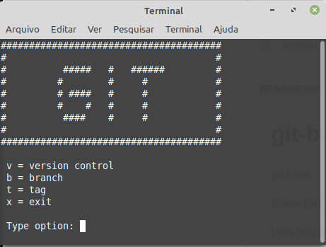

# git-bash
git-bash

Some bash files to try to make working with git faster. Proceed at your own risk

How to use:
Copy the git directory and the terminal.sh file to the source of your project.

Run in Linux:
$ sh terminal.sh

